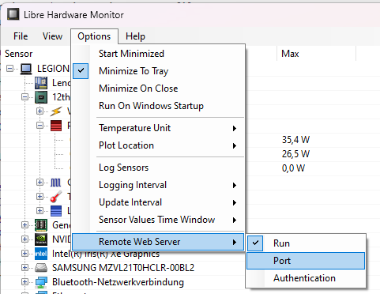

# jPowerMonitor
JUnit Extension and Java Agent for energy consumption measurement.

### Description
The power consumption of Java applications should become measurable, and thus visible, with the help of jPowerMonitor.
This library includes an extension for measuring unit tests, as well as a Java agent for measuring any Java application.
The Java agent collects the activity of the application to be measured at regular, configurable intervals. The agent takes into account the power consumption provided by the configured measurement tool.
The CPU usage of the program and the current power consumption are aggregated to energy consumption per method over runtime and written into a CSV file.
The result of the measurement is the energy consumption in watt hours or joule.

### Prerequisites
- Tool Libre Hardware Monitor is installed: https://github.com/LibreHardwareMonitor/LibreHardwareMonitor
- Libre Hardware Monitor is configured to start a web server:
  
- If necessary, an alternative port (default is 8085) can be also activated there.
- __IMPORTANT: To start the web server, Libre Hardware Monitor may have to be started as administrator.__
- After that the tool is also accessible in the browser: http://localhost:8085/.
- The JUnit extension internally reads the json document, which can be retrieved at http://localhost:8085/data.json.
- __To start the Java agent, the "fat jar" (incl. dependencies) first must be built using the Gradle task "shadowJar"__.
- __Copy "src/main/resources/jpowermonitor-template.yaml" to the execution directory and rename to "./jpowermonitor.yaml"__.
- __Configure (at least) measurement -> lhm -> paths -> path to fit your machine__.
- Tool HWiNFO could be used alternatively, __measurement -> method__ must be set to 'csv' and Logging to CSV in HWiNFO must be active: https://www.hwinfo.com/

### Java Agent
- For testing call with `java -javaagent:.\build\libs\jpowermonitor-1.0.3-SNAPSHOT-all.jar[=path-to-jpowermonitor.yaml] -jar .\build\libs\jpowermonitor-1.0.3-SNAPSHOT-all.jar [runtimeSeconds] [cpuThreads]`
- .\build\libs\jpowermonitor-1.0.3-SNAPSHOT-all.jar is just an example and can be replaced by any *.jar of your choice
- For starting the agent with Spring Boot, Servlet-Container etc. please consult the respective documentation for adding a java agent.

### Limitations
- The tool currently only works with German locale setting.

### Configuration
The configuration is done via a YAML file. Normally this would be `jpowermonitor.yaml`. The agent
has multiple ways of getting this configuration:
1. You can pass it as a programm argument, see section above. If not, it will simply assume the name
   and path is `jpowermonitor.yaml`.
2. It first tries to read this path as an external file.
3. If that fails, it tries to load this path from the JAR's resources

For the configuration of the JUnit extension a yaml file with the name of the executed test is searched.

| configuration path                                   | description                                                                                                                                                                                                                                                                                 | optional | default value                                                                                                                |
|------------------------------------------------------|---------------------------------------------------------------------------------------------------------------------------------------------------------------------------------------------------------------------------------------------------------------------------------------------|----------|------------------------------------------------------------------------------------------------------------------------------|
| initCycles                                           | The number of cycles to initialize for measuring the base load on the system.  <br/>_(Parameter is only used in JUnitExtension, not in JavaAgent)_                                                                                                                                          | X        | 10                                                                                                                           |
| samplingIntervalForInitInMs                          | Polling interval for initialization phase.  <br/>_(Parameter is only used in JUnitExtension, not in JavaAgent)_                                                                                                                                                                             | X        | 1000                                                                                                                         |
| calmDownIntervalInMs                                 | After initialization, the system waits until the test starts.  <br/>_(Parameter is only used in JUnitExtension, not in JavaAgent)_                                                                                                                                                          | X        | 1000                                                                                                                         |
| percentageOfSamplesAtBeginningToDiscard              | What percentage of samples should be discarded at the beginning of the measurement to get more meaningful results. Meaningful: 5-20%.  <br/>_(Parameter is only used in JUnitExtension, not in JavaAgent)_                                                                                  | X        | 15                                                                                                                           |
| samplingIntervalInMs                                 | Polling interval for test phase.  <br/>_(Parameter is only used in JUnitExtension, not in JavaAgent)_                                                                                                                                                                                       | X        | 300                                                                                                                          |   
| carbonDioxideEmissionFactor                          | Conversion factor to calculate approximated CO2 consumption in grams from energy consumption per kWh. Depends on the energy mix of your location, for germany compare e. g. https://www.umweltbundesamt.de/themen/klima-energie/energieversorgung/strom-waermeversorgung-in-zahlen#Strommix | X        | 485                                                                                                                          |
| measurement -> method                                | Specify which measurement method to use. Possible values: lhm, csv                                                                                                                                                                                                                          |          | 'lhm'                                                                                                                        |
| measurement -> csv                                   |                                                                                                                                                                                                                                                                                             | X        | Configuration for reading from csv file. E.g. output from HWInfo                                                             |
| measurement -> csv -> inputFile                      | Path to csv file to read measure values from                                                                                                                                                                                                                                                |          | 'hwinfo.csv'                                                                                                                 |
| measurement -> csv -> lineToRead                     | Which line in the csv input file contains the current measured values? The first or the last? This depends on the measurement tool. Possible value: first, last                                                                                                                             | X        | 'last'                                                                                                                       |
| measurement -> csv -> columns                        |                                                                                                                                                                                                                                                                                             |          | Columns to read, index starts at 0.                                                                                          |
| measurement -> csv -> columns -> index               | Index from a sensor, index starts at 0.                                                                                                                                                                                                                                                     |          | 95                                                                                                                           |
| measurement -> csv -> columns -> name                | Name of a sensor                                                                                                                                                                                                                                                                            |          | 'CPU Package Power [W]'                                                                                                      |
| measurement -> csv -> columns -> energyInIdleMode    | For the current measuring sensors the base load per sensor path can be configured (self-measured). If nothing is specified, then a base load measurement is performed in `@BeforeAll` (see also initCycles and samplingIntervalForInitInMs) and this value is used.                         | X        |                                                                                                                              |
| measurement -> csv -> encoding                       | Encoding to use for reading the csv input file                                                                                                                                                                                                                                              | X        | 'UTF-8'                                                                                                                      |
| measurement -> csv -> delimiter                      | Delimiter to use for separating the columns in the csv input file                                                                                                                                                                                                                           | X        | ','                                                                                                                          |
| measurement -> lhm                                   |                                                                                                                                                                                                                                                                                             | X        | Configuration for reading from Libre Libre Hardware Monitor                                                                         |
| measurement -> lhm -> url                            | (** started in administrator mode **)                                                                                                                                                                                                                                                       |          | Url of the Libre Hardware Monitor incl. port                                                                                  |
| measurement -> lhm -> paths                          |                                                                                                                                                                                                                                                                                             |          | Multiple paths to the sensors can be specified. This depends on the machine and must be viewed in the Libre Hardware Monitor. |
| measurement -> lhm -> paths -> path                  |                                                                                                                                                                                                                                                                                             |          | Path to a sensor                                                                                                             |
| measurement -> lhm -> paths -> energyInIdleMode      | For the current measuring sensors the base load per sensor path can be configured (self-measured). If nothing is specified, then a base load measurement is performed in `@BeforeAll` (see also initCycles and samplingIntervalForInitInMs) and this value is used.                         | X        |                                                                                                                              |
| csvRecording -> resultCsv                            |                                                                                                                                                                                                                                                                                             | X        | Result CSV Name (specify paths with slash, they will be created automatically)                                               |
| csvRecording -> measurementCsv                       | Measurement CSV Name (specify paths with slash, they will be created automatically)                                                                                                                                                                                                         | X        |                                                                                                                              |
| javaAgent -> packageFilter                           | Filter power and energy for methods starting with this packageFilter names, write results of filtered methods to separate CSV files.                                                                                                                                                        | X        | 'group.msg', de.gillardon'                                                                                                   |
| javaAgent -> measurementIntervalInMs                 | Energy measurement interval in milliseconds for the Java Agent. This is the interval the data source for the sensor values is questioned for new values.                                                                                                                                    | X        | 1000                                                                                                                         |
| javaAgent -> gatherStatisticsIntervalInMs            | Gather statistics interval in milliseconds. This is the interval the stacktrace of each active thread is questioned for active methods. Should be smaller than `measurementIntervalInMs`.                                                                                                   | X        | 10                                                                                                                           |
| javaAgent -> writeEnergyMeasurementsToCsvIntervalInS | Write energy measurement results to CSV files interval in seconds. Leave empty to write energy measurement results only at program exit (be sure your application to measure exits "gracefully", thus by calling System.exit(..), else results might be lost!).                             | X        | 30                                                                                                                           |

If no base load (`energyInIdleMode`) is specified for a path, this is measured before each test. So a mixed operation between configuration of the base load and measurement is also possible and the results can be compared (some sensors provide very similar values).
For non current measuring sensors (e.g. temperature) the base load is not calculated extra and also not subtracted from the measured value! It is only output if a base load must also be calculated for a current-measuring sensor because this is not specified in the configuration.

### Integration into own project
#### Gradle
You may build the jpowermonitor fat jar using the build target `shadowJar` and the copy the `-all.jar` into a folder of your project.

The add the test dependency to your gradle build (analogue for maven builds):
```
    testImplementation files('libs/jpowermonitor-1.0.3-all.jar')
```

Alternatively you call the build target `publishLocal` in the jPowerMonitor project and publish the jar to your local maven repository.
You then add the following test dependency to your build script:
```
    testImplementation(
        [group: 'group.msg', name: 'jpowermonitor', version: jPowerMonitorVersion],
    )
```

#### JUnit Tests
The extension is designed for JUnit 5 (jupiter) tests and is included into your test class as follows:
```
@ExtendWith({JPowerMonitorExtension.class})
```

jPowerMonitor then searches for a configuration file with the name of the executed test + `.yaml` extension.
For example if your test is named `MyAlgorithmText.java` then the configuration for jPowerMonitor is expected to be found in `MyAlgorithmText.yaml` somewhere in the classpath.

The tests are best executed as `@RepeatedTests(...)` in order to obtain several measurements. For example always 10 times.
In the result CSV (configuration: `resultCsv`) you can then calculate an average of the results in Excel.

`@SensorValues` annotated fields in the test class of the type `List<SensorValue>` can be retrieved after each test in the `@AfterEach` method.

A `SensorValue` contains the resulting measured value with name of the sensor and the following additional information:
- `Unit unit`: The unit of the value (e.g. W, J, Wh)
- `BigDecimal powerInIdleMode`: The power consumption that has been measured in idle mode.
- `LocalDateTime executionTime`: The execution time of measure.
- `long durationOfTestInNanoSeconds`: The duration of the whole test.
- `BigDecimal valueWithoutIdlePowerPerHour`: The value without the idle power value.
- `BigDecimal valueWithIdlePowerPerHour`: The value together with the idle power value.

The sensor values could be used to create your own output file in your own format.

The file for the measuring points can be configured under `csvRecording.measurementCsv`. jPowerMonitor outputs all considered measurement points (also those of the base load measurement, if it takes place) into this file.

_Please note_: the first `percentageOfSamplesAtBeginningToDiscard`% measurement points are always discarded.

The result file can be configured under `csvRecording.resultCsv`. The summary of energy consumption is written to this file.

The headers of the csv output file are configured in the [csvExport.properties](src%2Fmain%2Fresources%2FcsvExport.properties) (default language English).
The file currently is translated into German and French and is locale dependent.
You may add your own locale and add the translated file to the classpath. You may set the language via JVM option e.g. `-Duser.language=es`.

#### Note
This markdown can be converted to html with
`pandoc --self-contained -t slidy -c docs/slidy.css -o Readme.html README.md` to html and from there to pdf via print function of the browser.

# Copyright & License
Copyright &copy; 2022-2023 msg for banking ag <br/>
Licensed under [Apache License 2.0](./LICENSE.txt)
