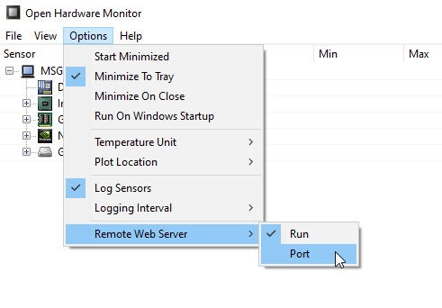

# jPowerMonitor
JUnit Extension and Java Agent for energy consumption measurement.

### Description
The power consumption of Java applications should become measurable, and thus visible, with the help of jPowerMonitor.
This library includes an extension for measuring unit tests, as well as a Java agent for measuring any Java application.
The Java agent collects the activity of the application to be measured at regular, configurable intervals. The agent takes into account the power consumption provided by the configured measurement tool.
The CPU usage of the program and the current power consumption are aggregated to energy consumption per method over runtime and written into a CSV file.
The result of the measurement is the energy consumption in watt hours or joule.

### Prerequisites 
- Tool Open Hardware Monitor is installed: https://openhardwaremonitor.org/downloads/
- Open Hardware Monitor is configured to start a web server: 
  
- If necessary, an alternative port (default is 8085) can be also activated there.
- __IMPORTANT: To start the web server, Open Hardware Monitor may have to be started as administrator.__
- After that the tool is also accessible in the browser: http://localhost:8085/.
- The JUnit extension internally reads the json document, which can be retrieved at http://localhost:8085/data.json.
- __To start the Java agent, the "fat jar" (incl. dependencies) first must be built using the Gradle task "shadowJar"__.
- __Copy "src/main/resources/jpowermonitor-template.yaml" to the execution directory and rename to "./jpowermonitor.yaml"__.
- __Configure (at least) openHardwareMonitor.paths.path to fit your machine__.

### Java Agent
- Call with __java -javaagent:.\build\libs\jpowermonitor-0.1.0-SNAPSHOT-all.jar[=path-to-jpowermonitor.yaml] -jar .\build\libs\jpowermonitor-0.1.0-SNAPSHOT-all.jar [runtimeSeconds] [cpuThreads]__
- .\build\libs\jpowermonitor-0.1.0-SNAPSHOT-all.jar is just an example and can be replaced by any *.jar of your choice
- For starting the agent with Spring Boot, Servlet-Container etc. please consult the respective documentation

### Limitations
- The tool currently only works with German locale setting.

### Configuration
The configuration is done via a YAML file. Normally this would be `jpowermonitor.yaml`. The agent
has multiple ways of getting this configuration:
1. You can pass it as a programm argument, see section above. If not, it will simple assume the name
   and path is `jpowermonitor.yaml`.
1. It first tries to read this path as an external file.
1. If that fails, it tries to load this path from the JAR's resources

| configuration path                                   | optional | default value                                                                                                                | description                                                                                                                                                                                                                                                         |
|------------------------------------------------------|----------|------------------------------------------------------------------------------------------------------------------------------|---------------------------------------------------------------------------------------------------------------------------------------------------------------------------------------------------------------------------------------------------------------------|
| initCycles                                           | X        | 10                                                                                                                           | The number of cycles to initialize for measuring the base load on the system.                                                                                                                                                                                       |
| samplingIntervalForInitInMs                          | X        | 1000                                                                                                                         | Polling interval for initialization phase.                                                                                                                                                                                                                          |
| calmDownIntervalInMs                                 | X        | 1000                                                                                                                         | After initialization, the system waits until the test starts.                                                                                                                                                                                                       |
| percentageOfSamples AtBeginningToDiscard             | X        | 15                                                                                                                           | What percentage of samples should be discarded at the beginning of the measurement to get more meaningful results. Meaningful: 5-20%.                                                                                                                               |
| samplingIntervalInMs                                 | X        | 300                                                                                                                          | Polling interval for test phase.                                                                                                                                                                                                                                    |   
| openHardwareMonitor -> url                           |          | Url of the Open Hardware Monitor incl. port                                                                                  |
| openHardwareMonitor -> paths                         |          | Multiple paths to the sensors can be specified. This depends on the machine and must be viewed in the Open Hardware Monitor. |
| openHardwareMonitor -> paths -> path                 |          | Path to a sensor                                                                                                             |
| openHardwareMonitor -> paths -> energyInIdleMode     | X        |                                                                                                                              | For the current measuring sensors the base load per sensor path can be configured (self-measured). If nothing is specified, then a base load measurement is performed in `@BeforeAll` (see also initCycles and samplingIntervalForInitInMs) and this value is used. |
| csvRecording -> resultCsv                            | X        | Result CSV Name (specify paths with slash, they will be created automatically)                                               |
| csvRecording -> measurementCsv                       | X        |                                                                                                                              | Measurement CSV Name (specify paths with slash, they will be created automatically)                                                                                                                                                                                 |
| javaAgent -> packageFilter                           | X        | 'com.msg', de.gillardon'                                                                                                     | Filter power and energy for methods starting with this packageFilter names, write results of filtered methods to separate CSV files.                                                                                                                                |
| javaAgent -> measurementIntervalInMs                 | X        | 1000                                                                                                                         | Energy measurement interval in milliseconds for the Java Agent. This is the interval the data source for the sensor values is questioned for new values.                                                                                                            |
| javaAgent -> gatherStatisticsIntervalInMs            | X        | 10                                                                                                                           | Gather statistics interval in milliseconds. This is the interval the stacktrace of each active thread is questioned for active methods. Should be smaller than `measurementIntervalInMs`.                                                                           |
| javaAgent -> writeEnergyMeasurementsToCsvIntervalInS | X        | 30                                                                                                                           | Write energy measurement results to CSV files interval in seconds. Leave empty to write energy measurement results only at program exit (be sure your application to measure exits "gracefully", thus by calling System.exit(..), else results might be lost!).     |

If no base load (`energyInIdleMode`) is specified for a path, this is measured before each test. So a mixed operation between configuration of the base load and measurement is also possible and the results can be compared (some sensors provide very similar values).
For non current measuring sensors (e.g. temperature) the base load is not calculated extra and also not subtracted from the measured value! It is only output if a base load must also be calculated for a current-measuring sensor because this is not specified in the configuration.

### Integration into own project
#### Gradle
Dependency:
```
testImplementation files('libs/jpowermonitor-0.1.0-all.jar')
```

#### JUnit Tests
The extension is designed for JUnit 5 (jupiter) tests and is included as follows:
```
@ExtendWith({JPowerMonitorExtension.class})
```

The tests are best executed as `@RepeatedTests(...)`. For example always 10 times.
In the result CSV (configuration: `resultCsv`) you can then calculate an average of the results in Excel.

`@SensorValues` annotated fields in the test class of the type `List<SensorValue>` can be retrieved after each test in the `@AfterEach` method.

The `measurementCsv` outputs all considered measurement points (also those of the base load measurement, if it takes place). Please note: the first `percentageOfSamplesAtBeginningToDiscard` % measurement points are always discarded.

## Measure
I got very good results after I calibrated the PC with the (deprecated and no longer supported) Microsoft tool Joulemeter (download e.g. here: https://www.chip.de/downloads/Microsoft-Joulemeter_79226593.html). After that, all current values went extremely down, the CPU temperature decreased massively (before around 98 C, afterwards around 55 C) and the results were much more comparable!


#### Note
This markdown can be converted to html with
`pandoc --self-contained -t slidy -c docs/slidy.css -o Readme.html README.md` to html and from there to pdf via print function of the browser.
